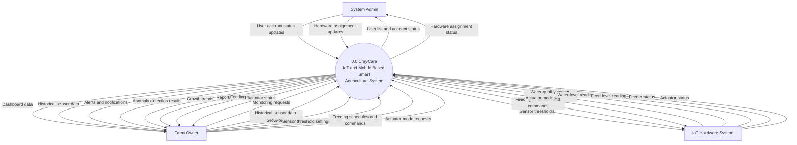
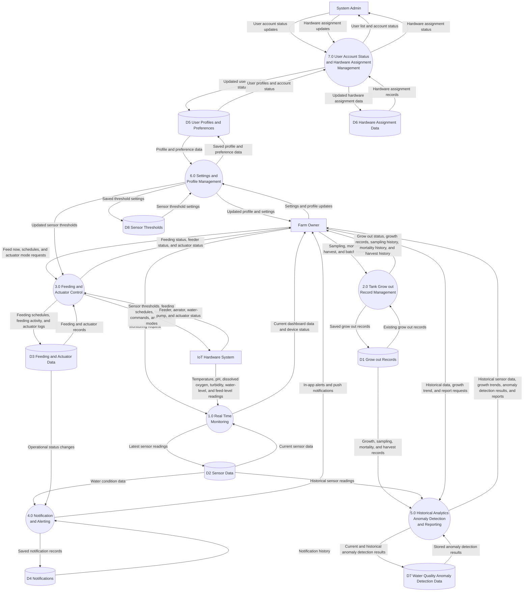

# CrayCare Data Flow Diagrams

## Data Flow Diagram Level 0

## Data Flow Diagram Level 1

## Diagram Notes

- The ML anomaly detector is represented inside Process 5.0 because it is a supporting CrayCare function, not an external actor.
- Feed level is included in the IoT Hardware System data for feeder monitoring, but it is not an input to water quality anomaly detection.
- D1 stores batch, sampling, mortality, and harvest records.
- D2 stores the latest sensor data and historical sensor readings used by monitoring, alerting, and analytics.
- D7 stores the current and hourly historical water-quality anomaly-detection results.
- D8 stores the sensor-threshold settings used by actuator control.
- Reports and growth trends are computed from stored records and returned to the owner; they are not separate stored tables.
